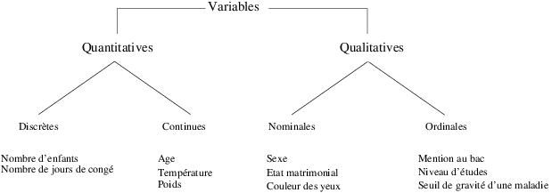

# Présentation de Rstudio

RStudio est une interface du logiciel R. Il comprend 4 fenêtres : 

* Une fenêtre edition où l'on mettra les scripts R. Il est à noter qu'on peut exécuter la ligne courante en tapant ctrl R (pour exécuter plusieurs lignes, il faut les sélectionner) ou en cliquant sur run 
* Une fenêtre console qui permet d'executer des commandes
* Une fenêtre espace de travail et historique
* Une fenêtre explorateur, graphiques, packages, aide.


Vous devez créer un nouveau script R que vous nommerez "TP1.R". Pensez à commenter chacune de vos lignes de commandes.

# R est un super-calculateur

Il est possible d'effectuer des calculs très simples comme :

* calcul simple
```{r}
5*(-3.2)
```

* fonction puissance
```{r}
5^2
5**2
```

* fonctions trigonométriques

```{r}
sin(2*pi/3)
```

* d'autres fonctions utiles

```{r}
sqrt(3)/2
log(exp(1))
log(1)
```

# Affectations

```{r}
x<-1
x
2*x
ch <- "Voici une chaîne"
ch
(ch <- 'Voici une chaîne')
(nb <- 101)
(nb2 <- 101L)
c(TRUE,FALSE,T,F)
nb==nb2
identical(nb,nb2)
NA
c(NaN,log(-1),0/0)
c(Inf,1/0,-1/0)
(a <- 1+2i)
rm(ch,nb,nb2,a)
```

# Différents types de données


## Vecteurs

On peut créer des vecteurs via la commande suivante

```{r}
c(1,2,3,4,5)
c(1:5)

v <- c(1,3,2)
v

logical(2)
integer(1)
numeric()
character(3)

1:10
seq(1,10)

rep(2,3)
rep(1:2,3)
rep(1:2,2:3)
rep(c("toto","tutu"),2:1)

paste(c("toto","tutu"),1:2)
paste(c("toto","tutu"),1:2,sep="")
paste(c("toto","tutu"),1:2,collapse=" & ")


```

On peut également effectuer des opérations sur les vecteurs :

```{r}
x<-c(10:22)
y<-2*c(1:5)
z<-seq(0,20,1.3)
z[8]
z[-8]
z[1:8]
z[-(1:8)]
z[9:length(z)]
z[c(2,6,14)]
z[z>10]
z[z>4 & z<15]
```

## Extraction dans un vecteur

```{r}
v
v[c(1,3)]
v[v %in% c(1,2)]
v %in% c(1,2)
v[c(TRUE,FALSE,TRUE)]
```

## Listes

```{r}
(l <- list(1:10,c("toto","titi")))
(l2 <- list(a=1:10,b=c("toto","titi")))
c(l,l2)
```

### Extraction dans une liste

```{r}
l2[[1]]   # élément de l2 par index
l2$a      # élément "a" de l2 (mode utilisateur)
l2[["a"]] # même chose (mode développeur)
clé<-"a"  # si clé variable contenant "a" (ou 1)
l2[[clé]] # permet l'extraction par variable
## ATTENTION!
l2$clé    # car clé pas élément de l2
names(l2) # comme il est montré ici
```

### Extraction dans une sous liste

```{r}
l2[1]
names(l2)
l2[c(2,1)]
names(l2) # comme il est montré ici
```

## Matrices

```{r}
A<-matrix(1:12,nrow=4,ncol=3,byrow=TRUE)
B<-matrix(1:12,nrow=4,ncol=3)
t(A)
A[2,3]
A[,3]
A[,c(1,3)]
t(B)%*%A
```

## Auto-conversion vecteur

```{r}
a <- c(TRUE,2L)
a
class(a)
a <- c(a,3)
a
class(a)
a <- c(a,"quatre")
a
class(a)
rm(a)
```

## Auto-conversion vector -> list

```{r}
c(l,v) # équivalent à c(l,as.list(v))
c(v,l) # équivalent à c(as.list(v),l)
```

## Recycling

```{r}
(1:8)[c(TRUE,FALSE)]
(1:9)[c(TRUE,FALSE)]
(1:8)[c(TRUE,FALSE,FALSE)]
cbind(1:5,c(TRUE,FALSE,FALSE))
```

Attention le reycling ne fonctionne pas sur les dataframes (cf. ci-dessous).

## Tableau individus$\times$variables

Cette structure est très utilisée en statistique et se nomme data.frame sous R. 
C'est une matrice dont les lignes correspondent aux individus et les colonnes aux variables mesurées sur ces individus.
Chaque colonne représente une variable dont tous les éléments sont du même type.
Voici un exemple :

```{r}
IMC <- data.frame(Sexe=c("H","F","H","F"),Taille=c(1.83,1.76,1.82,1.60),Poids=c(67,58,66,48),row.names=c("Pierre","Valérie","Paul","Virginie"))
```

## Les facteurs (factor) et les variables ordinales (ordered)

Le logiciel permet d'organiser les chaînes de caractères au moyen de factor() :

```{r}
x<-factor(c("bleu","vert","bleu","rouge","bleu","vert","vert"))
x
levels(x) 
class(x)
```

Il est possible de mettre des facteurs dans un data.frame. La fonction factor() est donc à utiliser pour stocker les variables qualitatives. Pour les variables ordinales, il est plutôt conseillé d'utiliser la fonction ordered():

```{r}
z <- ordered(c("Petit","Grand","Moyen","Grand","Moyen","Petit","Petit"),levels=c("Petit","Moyen","Grand")) 
class(z)
z
```

# Fonctions sous R

Une fonction est un objet R, comme les vecteurs, les matrices, les tableaux de données. Il existe beaucoup de fonctions classiques que vous serez amenés à utiliser. Ainsi, la fonction c() permet de créer un vecteur.

```{r}
c(1:5)
```

## Mes premières fonctions

Vous pouvez également créer vos propres fonctions. La syntaxe est la suivante

```{r}
Hello <- function()
{
cat("Hello World","\n")	
}
```

Ensuite, vous pouvez exécuter cette fonction comme suit (ne pas oublier les parenthèses)

```{r}
Hello()
```

On peut remarquer que la fontion précédente n'avait pas d'argument. La plupart du temps, les fonctions possèdent des arguments en entrée.

```{r}
Bonjour <- function(x)
{
  cat("Bonjour",x,"\n")	
}
```

```{r}
Bonjour("et bon TP")
```

## Quelques fonctions usuelles

La fonction sample(x) permet de tirer aléatoirement parmi les éléments de x, avec ou sans remise. Ainsi, on peut simuler 10 lancers d'une pièce de monnaie comme suit (en considérant que les 1 sont des piles et les 0 des faces) :

```{r}
sample(0:1,10,replace=T)
```

On peut également générer des nombres aléatoires entre 0 et 1 par la fonction runif :

```{r}
runif(5)
```

Une autre commande utile est replicate() qui permet de répéter une expression. On peut par exemple répéter 100 fois le lancement de 10 pièces de monnaie.

```{r}
lancer <- function() sample(0:1,10,replace=T)
simu <- replicate(100,lancer())
```

La fonction apply() permet de retourner un vecteur obtennu en appliquant une fonction sur une matrice. On peut, dans l'exemple précédent, compre le nombre de piles obtenu par expérience.

```{r}
(nb.pile<-apply(simu,MARGIN=2,FUN=sum))
table(nb.pile)
barplot(table(nb.pile)/100,main="Diagramme en baton des piles obtenus",xlab="Nombre de piles")
```

# Exercices

* Faire une fonction qui simule le lancement d'une pièce (résultat pile ou face).

* Faire une fonction qui simule le lancement d'un dé à 6 faces (avec la fonction sample()).

* Simuler le jeu de Yams (lancer de 5 dés simultanément) en utilisant les paramètres size et replace de la fonction sample().

* Estimer la probabilité d'obtenir un yams en utilisant les fonctions apply(), replicate() et unique(). Comparer à la valeur théorique.

# TP : Etude sur l'indice de la masse corporelle

On dispose d'un échantillon de 10 enfants agés de 3 ou 4 ans lors de leur entrée en maternelle. Les données disponibles pour chaque enfant sont :

* le sexe : F pour fille et G pour garçon;
* le fait que leur école soit située en ZEP : O pour oui et N pour non;
* l'âge en années et en mois (constituant deux variables);
* le poids en kg arrondi à 100 g près;
* la taille en cm arrondie à 0,5 cm près.


| Prénom | Erika | Célia | Eric | Eve  | Paul | Jean | Adan | Louis | Jules | Léo  |
|--------|-------|-------|------|------|------|------|------|-------|-------|------|
| Sexe   | F     | F     | G    | F    | G    | G    | G    | G     | G     | G    |
| ZEP    | O     | O     | O    | O    | N    | O    | N    | O     | O     | O    |
| Poids  | 16    | 14    | 13.5 | 15.4 | 16.5 | 16   | 17   | 14.8  | 17    | 16.7 |
| An     | 3     | 3     | 3    | 4    | 3    | 4    | 3    | 3     | 4     | 3    |
| Mois   | 5     | 10    | 5    | 0    | 8    | 0    | 11   | 9     | 1     | 3    |
| Taille | 100   | 97    | 95.5 | 101  | 100  | 98.5 | 103  | 98    | 101.5 | 100  |

1. Choisissez la fonction R appropriée pour enregistrer les données de chacune des variables dans des vecteurs que vous nommerez Individus, Poids, Taille et Sexe.
2. Calculez la moyenne des variables lorsque c'est possible.
3. Calculer l'IMC des individus et regroupez les valeurs obtenues dans un vecteur nommé IMC sachant que 
$$
IMC= \displaystyle \frac{Poids (kg)}{Taille^2(m)}
$$
4. Regroupez ces variables dans la structure R qui vous paraît la plus adaptée.
5. Utilisez l'aide en ligne de R afin d'obtenir des informations sur la fonction plot().
6. Tracez le nuage de points du Poids en fonction de la Taille. Pensez à fournir un titre à votre graphique et à annoter vos axes.

# Importer des données

## Importer des données depuis un fichier texte ASCII

On peut entrer à la main dans un fichier à l'aide de votre éditeur de texte préféré. Lorsque le nombre de données est important, il est préférable d'utiliser un tableur.

Il existe trois fonctions R principales à utiliser pour importer des données depuis un fichier texte :

* read.table() : pour les jeux de données sous forme de tableaux.
* read.ftable() : permet de lire les tableaux de contingence.
* scan() : beaucoup plus flexible et puissant.

### Importer avec read.table()

Cette instruction va lire les données présentes dans le fichier et les rapatrier sous la forme d'un data.frame :

```{r}
donnees <- read.table(file="nutriage.txt",header=T,sep="\t",dec=".")
library(DT)
datatable(donnees, options = list(pageLength = 5))
```

Vous avez intérêt à utiliser la fonction file.choose() à la place du nom du fichier. Cette fonction va ouvrir une boite de dialogue, dans laquelle vous pourrez aller chercher votre fichier.

La fonction read.table() comprend de nombreux paramètres dont les plus utilisés sont :

* file=chemin/vers/fichier : emplacement et nom du fichier à lire. file.choose() permet d'ouvrir une fenêtre de dialogue pour choisir le fichier.
* header=TRUE : valeur logique indiquant si le fichier contient le nom des variables sur la première ligne.
* sep="$\backslash t$" : les valeurs sur chaque ligne sont séparées par ce caractère ("$\backslash t$" pour tabulation, " " pour un espace, "," pour une virgule).
* dec="." : séparateur décimal pour les nombres ("." ou ",").
* row.names=1 : la première colonne du fichier contient le nom des individus. Si ce n'est pas le cas, il suffit d'omettre ce paramètre.

La fonction attach() permet d'avoir accès aux variables du data.frame directement en tapant leur nom.

```{r}
attach(donnees)
```

```{r}
rnorm(10)
```


## Importer depuis RStudio

RStudio permet d'importer directement des données via le menu "Environment" puis l'onglet "Import Dataset". Télécharger le fichier nommé "nutriage.txt" depuis l'intranet et créer sous R le dataframe associé à ce jeux de données, que vous nommerez "nutriage". La description de ce jeu de données se trouve dans le fichier "nutriage.html", que vous trouverez sur l'intranet. 

Question : Combien y-a-t-il de variables ? Combien y-a-t-il d'invidus ?

# Etude d'un jeu de données

## Structuration des variables suivant leur type

En statistique, on classe les variables selon 4 catégories :

* qualitatives nominales (sans ordre)
* qualitatives ordinales (avec ordre)
* quantitatives discrètes
* quantitatives continues



Question : A partir de cette figure, classer toutes les variables du jeu de données nutriage ?

Par défaut, R considère toute variable à variable numérique comme étant quantitative. Pour changer le type d'une variable, vous utiliserez les fonctions suivantes :

* Pour rendre la la variable qualitative nominale, on utilise pour cela la fonction as.factor().
* Pour rendre la la variable qualitative ordinale, on utilise la fonction as.ordered(). 

Question : Pour toutes les variables qualitatives que vous avez identifiées, changer leurs types sous R.

De plus on utilise la fonction levels() pour recoder les modalités d'une variable qualitative. La fonction nlevels() donne le nombre de modalités de cette variable.

Question : Recoder les modalités des variables qualitatives en suivant le fichier explicatif "nutriage.html".

## Présentation synthétique des données

On dispose des mesures d'une ou plusieurs variables pour chacun des N individus. Le tableau donne les variables en colonne et les individus en ligne. Sous R, les données ainsi définies sont dans une structure appelée data.frame.

### Tableau des effectifs ou des fréquences d'une variable qualitative

Pour connaître la distribution d'une variable dans notre échantillon, il est plus pratique de représenter un tableau de données individuelles sous une forme plus condensée, par exemple un tableau des effectifs ou des fréquences. On peut le faire sous R grâce à la commande table(). On se servira de la fonction length() pour donner le tableau des fréquences. 

Question : Comment les personnes de cet échantillon utilisent les matières grasses pour cuisiner ?

Question : Combien de personnes mangent quotiennement de la viande ?

### Tableau de données regroupées en classes d'une variable quantitative
On peut représenter un tableau de données individuelles quantitatives en regroupant les valeurs par intervalle. Par exemple, on peut se servir de la fonction hist() en spécifiant le vecteur des bornes des classes dans son paramètre breaks.

```{r}
res<-hist(taille,plot=F)
nn<-as.character(res$breaks)
x<-as.table(res$counts)
dimnames(x)<-list(paste(nn[-length(nn)],nn[-1],sep="-"))
x
```

Question : Combien y-a-t-il d'individus dont la taille est dans l'intervalle ]155,160] ?

## Tableaux croisant deux variables qualitatives

### Tableau de contingence

On peut utiliser la fonction table() pour obtenir le tableau de contingence de deux variables

```{r}
matable<-table(sexe,situation)
matable
```

Question : Dans cet échantillon de 226 individus, quel est le pourcentage d'hommes vivant en couple ?

On peut ajouter les marges en utilisant la fonction addmargins().

```{r}
matable_complete <- addmargins(matable)
matable_complete
```

Question : Parmi les hommes, quel est le pourcentage d'homme vivant en couple ?

# Résumés numériques

Tous les exemples donnés seront effectués sur la variable taille. Les résumés numériques ne peuvent être calculés en présence de données manquantes (NA). Si cela est nécessaire, il est possible d'utiliser la fonction na.omit() pour les retirer lors du calcul.

```{r}
x<-na.omit(taille)
```

## Résumés de position d'une distribution d'une variable quantitative

### La médiane

La médiane d'une série statistique est la valeur $m_e$ de la variable $X$ qui partage cette série statistique en deux parties (inférieure et supérieure à $m_e$) de même effectif. Cette quantité ne se calcule pas sur des variables purement qualitatives. 

La fonction R est median() et s'applique uniquement sur des valeurs numériques.

```{r}
median(taille)
```

Question : Combien d'invidus mesurent strictement moins que la médiane et combien mesurent strictement plus que la médiane ?

### La moyenne

Elle se calcule uniquement sur des variables quantitatives via la fonction mean().

```{r}
mean(taille)
```

Question : Quelle est la moyenne de la variable taille ? La comparer à la moyenne ?

### Les fractiles

Le fractile d'ordre p (0<p<1) est la valeur $q_p$ qui coupe l'échantillon en deux portions, l'une ayant un nombre d'éléments (inférieurs à $q_p$) égal à $p\%$ du nombre total d'éléments et l'autre à $(1-p)\%$ étant supérieurs à $q_p$. Il ne se calcule pas pour des variables purement qualitatives. Si on prend $p=0.5$, on retrouve la définition de la médiane.

En R, la fonction quantile() (avec le paramètre probs) permet de donner les fractiles de la variable. 

```{r}
quantile(taille,probs=c(0.1,0.25,0.77))
```

En créant 3 vecteurs, vous donnerez 3 sorties pour la variable taille :

* 1er et 9ème déciles
* 1er, 2ème et 3ème quartiles
* tous les déciles

La fonction summary() appliquée sur un vecteur de données quantitatives permet de calculer le minimum, le maximum, la moyenne et les trois quartiles.

```{r}
summary(age)
```

Question : Donner les principaux résumés numériques pour la variable age.

## Résumé de dispersion autour de la moyenne d'une distribution

Ces résumés peuvent être calculés uniquement pour des variables quantitatives. Les principales sont :

* Variance $\sigma^2$ de la population. Attention, la fonction var() du logiciel R renvoie une estimation non biaisée de la variance.
* l'écart type est la racine carrée de la variance.
* Coefficient de variation $c_v=\frac{\sigma}{\mu}$

Reprogrammer les fonctions variance, écart-type, et coefficient de variation d'une population (qu'on nommera var.pop, sd.pop et co.pop).

