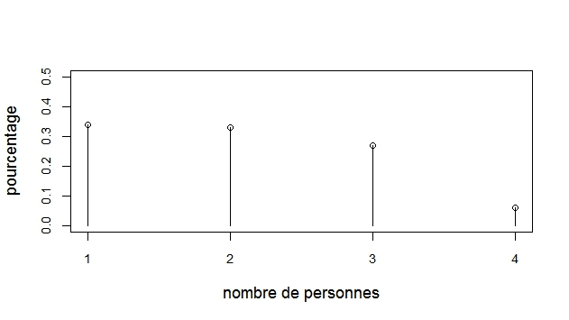
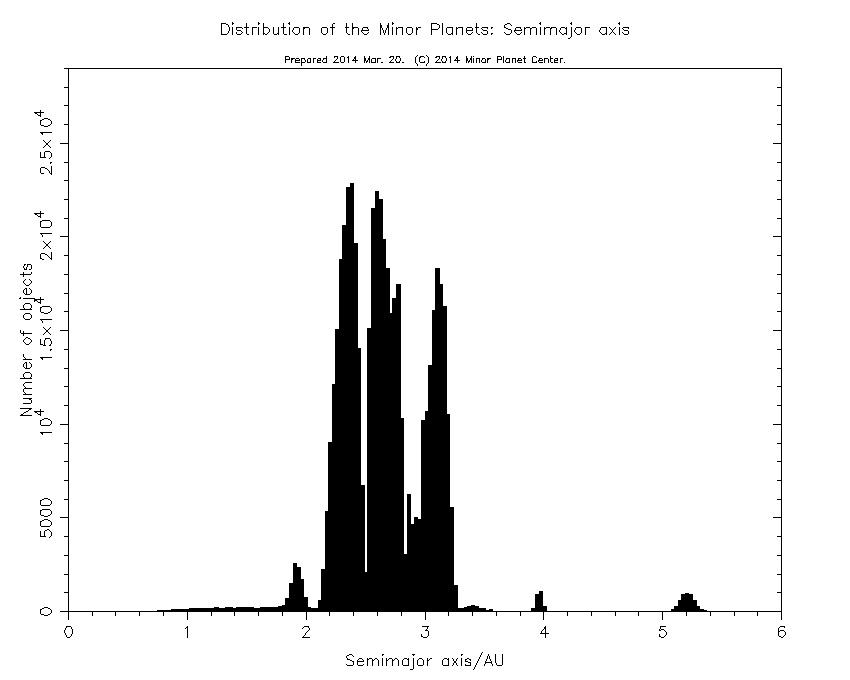
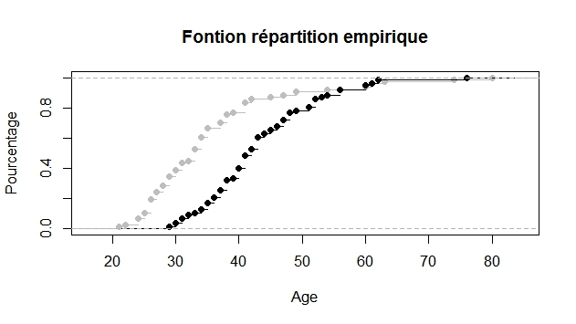

# Décrire une ou plusieurs séries de valeurs {#intro}

## Les graphiques

Si la série de valeurs est qualitative on fera un diagramme en barres : voir un exemple avec la figure 1.

Si la série de valeurs est quantitative :

- valeurs discrètes : diagramme en bâtons (voir figure 2)
- valeurs continues : histogramme (voir figure 3)

Pour les variables quantitatives, on peut aussi représenter la fonction de répartition (empirique) notée $\hat{F}(x)$: pour cela on calcule pour chaque point de l'axe des $x$ ainsi : (voir exemple figure 4)
\begin{align*}
\hat{F}(x)=\frac{ \text{nombre de valeurs dans la série}\leqslant x}{n}
\end{align*}

## Résumés numériques

### Résumés de position d'une distribution

#### Le ou les modes

Les modes sont les valeurs de la variable $X$ qui apparaissent le plus fréquemment. Il peuvent se calculer pour une variable de n'importe quel type, bien que pour une variable continue, on parle de classe modale.

#### La médiane

La médiane d'une série statistique est la valeur $m_e$ de la variable $X$ qui partage cette série statistique en deux parties (inférieure et supérieure à $m_e$) de même effectif. Cette quantité ne se calcule pas sur des variables purement qualitatives. Pour la calculer, on distingue deux cas :

- L'effectif total $N$ est impair, alors $m_e$ est la valeur située à la position $\frac{N+1}{2}$

- L'effectif total $N$ est pair, alors $m_e$ est n'importe quelle valeur entre $\frac N2$ et $\frac N2 +1$. 

#### La moyenne

Elle se calcule uniquement sur des variables quantitatives via la fonction mean().

#### Les fractiles

Le fractile d'ordre $p$ ($0<p<1$) est la valeur $q_p$ de la variable $X$ qui coupe l'échantillon en deux portions, l'une ayant un nombre d'éléments (inférieurs à $q_p$) égal à $p\%$ du nombre total d'éléments et l'autre à $(1-p)\%$ étant supérieurs à $q_p$. Il ne se calcule pas pour des variables purement qualitatives. Si on prend $p=0.5$, on retrouve la définition de la médiane.

### Résumé de dispersion d'une distribution

Ces résumés peuvent être calculés uniquement pour des variables quantitatives. Les principales sont :

- Variance $\sigma^2$ de la population.
- l'écart type est la racine carrée de la variance.
- Coefficient de variation $c_v=\frac{\sigma}{\mu}$

