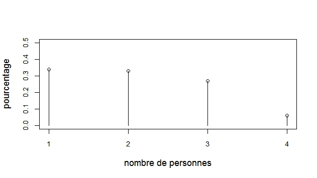
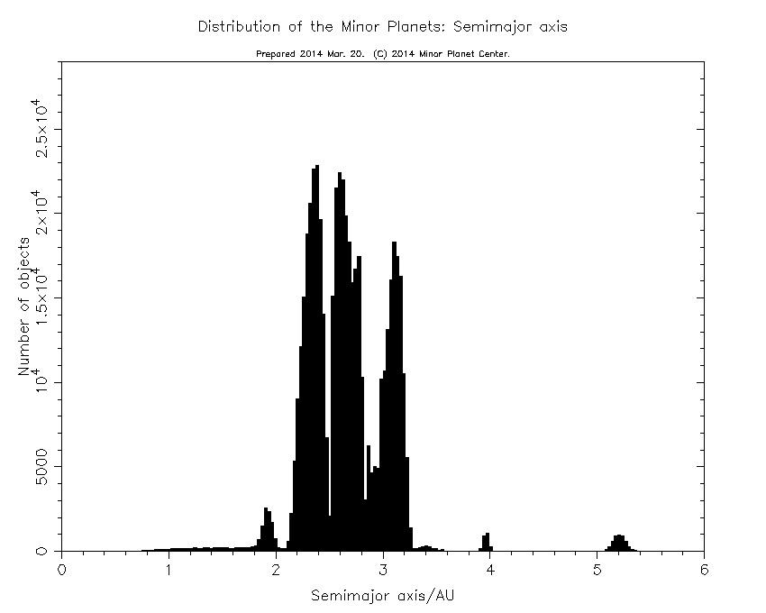
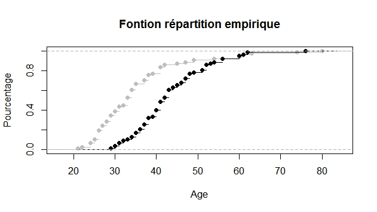

# Préambule

Ce support de cours est largement inspiré du livre de Lafaye de Micheaux et al. \cite{LAF} ainsi que du cours de Statistique de Bernard Ycart de l'Université de Grenoble Alpes.


# Décrire une ou plusieurs séries de valeurs

## Les graphiques

Si la série de valeurs est qualitative on fera un diagramme en barres : voir un exemple avec la figure 1.

Si la série de valeurs est quantitative :

- valeurs discrètes : diagramme en bâtons (voir figure 2)
- valeurs continues : histogramme (voir figure 3)







Pour les variables quantitatives, on peut aussi représenter la fonction de répartition (empirique) notée $\hat{F}(x)$: pour cela on calcule pour chaque point de l'axe des $x$ ainsi : (voir exemple figure 4)
\begin{align*}
\hat{F}(x)=\frac{ \text{nombre de valeurs dans la série}\leqslant x}{n}
\end{align*}



## Résumés numériques

### Résumés de position d'une distribution

#### Le ou les modes

Les modes sont les valeurs de la variable $X$ qui apparaissent le plus fréquemment. Il peuvent se calculer pour une variable de n'importe quel type, bien que pour une variable continue, on parle de classe modale.

#### La médiane

La médiane d'une série statistique est la valeur $m_e$ de la variable $X$ qui partage cette série statistique en deux parties (inférieure et supérieure à $m_e$) de même effectif. Cette quantité ne se calcule pas sur des variables purement qualitatives. Pour la calculer, on distingue deux cas :

- L'effectif total $N$ est impair, alors $m_e$ est la valeur située à la position $\frac{N+1}{2}$

- L'effectif total $N$ est pair, alors $m_e$ est n'importe quelle valeur entre $\frac N2$ et $\frac N2 +1$. 

#### La moyenne

Elle se calcule uniquement sur des variables quantitatives via la fonction mean().

#### Les fractiles

Le fractile d'ordre $p$ ($0<p<1$) est la valeur $q_p$ de la variable $X$ qui coupe l'échantillon en deux portions, l'une ayant un nombre d'éléments (inférieurs à $q_p$) égal à $p\%$ du nombre total d'éléments et l'autre à $(1-p)\%$ étant supérieurs à $q_p$. Il ne se calcule pas pour des variables purement qualitatives. Si on prend $p=0.5$, on retrouve la définition de la médiane.

### Résumé de dispersion d'une distribution

Ces résumés peuvent être calculés uniquement pour des variables quantitatives. Les principales sont :

- Variance $\sigma^2$ de la population.
- l'écart type est la racine carrée de la variance.
- Coefficient de variation $c_v=\frac{\sigma}{\mu}$

# Probabilités

## Variable aléatoire discrète


### Introduction et définition

La variable aléatoire $X$ est discrète si et seulement si elle prend ses valeurs dans un ensemble dénombrable (pour faire simple, un ensemble fini ou $\mathbb N$).

On note $X(\Omega)$, l'ensemble des valeurs prises par la variable aléatoire discrète. On appelle fonction de masse (de probabilités), la fonction suivante :
$$
\forall k\in X(\Omega), \, P(X=k)=p_k
$$

On a les propriétés suivantes :

$$\forall k\in X(\Omega), \, 0\leq p_k \leq 1$$
et

$$\displaystyle\sum_{k\in  X(\Omega)} p_k = 1$$


*Exemple 1* 

On suppose que $X$ suit une loi de Bernoulli de paramètre $p$ : $X\leadsto \mathcal B(p)$. $X$ prend la valeur $1$ avec la probabilité $p$ et $0$ avec la probabilité $q=1-p$.


*Exemple 2* 

On suppose que $X$ suit une loi binomiale de paramètre $n$ et $p$, notée $\mathcal B(n,p)$. Alors $X(\Omega)=<0,n>=\{0,1,\ldots,n\}$, où $n\in \mathbb N^\star$ et $p\in[0,1]$. Les probabilités associées, notées $p_k=P(X=k)$, sont :

$$
\forall k\in <0,n>, \, p_k=P(x=k)=C_n^k p^k (1-p)^{n-k}
$$

On remarque que la somme des probabilités est égale à 1 (formule du binôme de Newton) :

$$
\sum_{k=0}^n p_k = \sum_{k=0}^n C_n^k p^k (1-p)^{n-k} = [p+(1-p)]^n = 1^n = 1
$$

Pour rappel, la formule du binôme de Newton est :
$$
(a+b)^n = \sum_{k=0}^n C_n^k a^k b^{n-k}
$$
et où les coefficients du binôme (cf. triangle de Pascal) sont définis par :

$$
C_n^k = \dfrac{n!}{k!(n-k)!}
$$

avec $n!=n\times(n-1)\times(n-2)\times\ldots\times 2\times 1$ et par convention $0!=1$.

### Fonction de répartition

On appelle *fonction de répartition* de $X$ (f.d.r en français, c.d.f. en anglais pour cumulative density function) la fonction suivante $F_X$ :
$$
\forall x \in \mathbb R,\, F_X(x) = P(X\leq x) = \displaystyle \sum_{k:x_k\leq x} p_k
$$
Remarquez que cette fonction est définie sur $\mathbb R$.

*Exemple*

En reprenant l'exemple de la loi binomiale avec les paramètres, $n=10$ et $p=0.3$, on obtient :

```{r}
curve(pbinom(x,size=10,prob = 0.3),type="S",from = -1,to=11,ylab="y",
main=" Fonction de répartition de la loi binomiale B(10,0.3)")
```

Remarque : Dans la figure ci-dessus, la représentation de la fonction de répartition laisse croire que cette fonction est continue, ce qui n'est pas du tout le cas. Par définition, cette fonction est une fonction en escalier, continue à gauche, mais présentant des discontinuités en les modalités de la variable aléatoire.

### Espérance et variance

**Espérance de $X$**

Soit $X$ une variable aléatoire discrète de fonction de masse de probabilité $\forall k\in X(\Omega),\, f(k)=p_k$. On appelle espérance de $X$, que l'on note $\mathbb E[X]$, la quantité suivante :
$$
\mathbb E[X] = \sum_{k\in X(\Omega)} k p_k
$$
Dans cette définition, on suppose que cette espérance est finie.

*Exemple 1* 

On suppose que $X$ suit une loi de Bernoulli de paramètre $p$ : $X\leadsto \mathcal B(p)$. On rappelle que $X(\Omega)=\{0,1\}$ et $P(X=1)=p$ et $P(X=0)=1-p$.

L'espérance de $X$ est :
$$
\mathbb E[X] = \sum_{k\in X(\Omega)} k p_k = \sum_{k=0}^1 k p_k = 0*(1-p) + 1*p = p
$$

*Exemple 2*

On suppose que $X$ suit une loi de Poisson de paramètre $\lambda>0$ : $X\leadsto \mathcal P(\lambda)$. On rappelle que $X(\Omega)=\mathbb N$ et
$$
\forall k\in\mathbb N,\, P(X=k) = e^{-\lambda} \frac{\lambda^k}{k!}
$$

On peut vérifier que la somme des probabilités est égale à $1$ :
$$
\sum_{k=0}^{+\infty} p_k = \sum_{k=0}^{+\infty} e^{-\lambda} \frac{\lambda^k}{k!} = e^{-\lambda} \sum_{k=0}^{+\infty}  \frac{\lambda^k}{k!} = e^{-\lambda} *e^{-\lambda} = 1
$$
L'espérance de $X$ vaut :
$$
\mathbb E[X] = \sum_{k=0}^{+\infty} k p_k = e^{-\lambda} \sum_{k=1}^{+\infty} k \frac{\lambda^k}{k!} = e^{-\lambda} \sum_{k=1}^{+\infty} \frac{\lambda^k}{(k-1)!} = \lambda e^{-\lambda} \sum_{k=1}^{+\infty} \frac{\lambda^{k-1}}{(k-1)!}= \lambda e^{-\lambda} * e^{\lambda} = \lambda
$$

**Variance**

Soit $X$ une variable aléatoire discrète de fonction de masse de probabilité $\forall k\in X(\Omega),\, f(k)=p_k$. On appelle variance de $X$, que l'on note $\mathbb V[X]$, la quantité suivante :
$$
\mathbb V[X] = \mathbb E[(X-\mathbb E[X])^2] =\mathbb E[X^2]-\mathbb E[X]^2 
$$ 
où 
$$
\mathbb E[X^2] = \sum_{k\in X(\Omega)} k^2 p_k 
$$
en supposant que cette dernière somme est finie.

*Exemple 1*

En reprenant la loi de Bernoulli, on peut calculer le moment d'ordre $2$ :
$$
\mathbb E[X^2] =  \sum_{k\in X(\Omega)} k^2 p_k = \sum_{k=0}^1 k^2 p_k = 0^2*(1-p) + 1^2*p = p
$$
La variance de $X$ est donc :
$$
\mathbb V[X] = \mathbb E[X^2] - \mathbb E[X]^2 = p - p^2 = p(1-p)
$$

*Exemple 2*

En reprenant la loi de Poisson, on peut calculer le moment d'ordre $2$ :
$$
\mathbb E[X^2] = \sum_{k=0}^{+\infty} k^2 p_k = e^{-\lambda} \sum_{k=1}^{+\infty}k^2 \frac{\lambda^k}{k!} = e^{-\lambda} \sum_{k=1}^{+\infty}k \frac{\lambda^k}{(k-1)!} = e^{-\lambda} \sum_{k=1}^{+\infty}(k-1+1) \frac{\lambda^k}{(k-1)!}
$$

$$\mathbb E[X^2]=e^{-\lambda} \left [ \sum_{k=2}^{+\infty}(k-1) \frac{\lambda^k}{(k-1)!} + \sum_{k=1}^{+\infty}\frac{\lambda^k}{(k-1)!} \right ] = e^{-\lambda} \left [ \lambda^2\sum_{k=2}^{+\infty} \frac{\lambda^{k-2}}{(k-2)!} + \lambda \sum_{k=1}^{+\infty}\frac{\lambda^{k-1}}{(k-1)!} \right ]  = \lambda^2+\lambda
$$

et donc
$$
\mathbb V[X] = \mathbb E[X^2] - \mathbb E[X]^2 = \lambda^2+\lambda - \lambda^2 = \lambda
$$


## Densité et fonction de répartition d'une variable quantitative continue

La variable aléatoire $X$ associée à une fonction $f$ donnée et définie sur $\mathbb{R}$, continue par morceaux, représente le fait de tirer un nombre au hasard avec la probabilité suivante :$${\rm Proba}(X\leq t)=\int_{-\infty}^{t} f(x) dx = F(t)$$
où $t$ est un réel fixé.

Naturellement, cette écriture n'a de sens que si :

1. $f$ est une fonction positive sur $\mathbb{R}$

2. $\displaystyle\int_{-\infty}^{+\infty} f(x) dx=1$.

$f$ est appelée "**densité**" de $X$.

Cette probabilité est notée $F(t)$ : $F$, vue comme une fonction de $t$ définie sur $\mathbb{R}$, est appelée **fonction de répartition** de $X$. La valeur $F(t)$ peut être vue comme l'aire de la surface délimitée par la demi-droite $]-\infty,t]$, la droite $y=t$ et la courbe représentative de $f$. 

- L'espérance de $X$ (appelée aussi moyenne de $X$) correspond à la valeur suivante :
$$E(X)=\int_{-\infty}^{+\infty} xf(x)\,dx.$$
- La variance de $X$ est :
$${\rm Var}(X)=\mathbb E\left[ (X-\mathbb E[X])^2 \right]  = \mathbb E[X^2] - \mathbb E[X]^2 =  \int_{-\infty}^{+\infty}x^2f(x)\,dx-\mathbb E[X]^2.$$

## Exemple : la loi normale

On appelle loi normale la loi d'une variable aléatoire réelle continue $X$ dont la densité s'écrit :
$$f(x)=\frac{1}{\sigma\sqrt{2\pi}}e^{-\displaystyle\frac{1}{2}\frac{(x-\mu)^2}{\sigma^2}}$$
où $\mu$ est la moyenne de $X$ et $\sigma^2$ est la variance de $X$. On dit que $X$ suit la loi Normale de moyenne $\mu$ et de variance $\sigma^2$ et on note $X\leadsto \mathcal N(\mu,\sigma^2)$.

Si $\mu=0$, on dit que $X$ est centrée.

Si $\sigma^2=1$, on dit que $X$ est réduite.

Une propriété importante sur la loi normale est la suivante :

**Proposition**

Si $X\leadsto \mathcal N(\mu,\sigma^2)$ alors $\displaystyle \frac{X-\mu}{\sigma} \leadsto \mathcal N(0,1)$.


Remarque : Attention ! Cette propriété nous dit que pour centrer et réduire une loi normale, il faut lui retrancher sa moyenne et **diviser par l'écart type (et non pas la variance)**.

Les figures suivantes nous donnent des exemples de densité de différentes lois normales.

```{r}
curve(dnorm(x,0,1),from = -5,to = 7,col="red",main="Densités de lois normales",ylab="densité")
curve(dnorm(x,0,2),from = -5,to = 7,col="blue",add = TRUE)
curve(dnorm(x,2,2),from = -5,to = 7,col="green",add = TRUE)
legend(4,0.3,legend=c("N(0,1)","N(0,4)","N(2,4)"),col = c("red","blue","green"),lty=1)
```


## Loi forte des grands nombres

**Théorème**

Soit $(X_n)_{n\geq 1}$ une suite de variables aléatoires indépendantes, et identiquement distribuées. Soit
$$
\bar X_n = \dfrac{1}{n} \sum_{i=1}^n X_i
$$
et supposons que $\mathbb E[X_1]<\infty$. Alors
$$
\bar X_n \text{ converge vers }\mathbb E[X_1]
$$

Ce théorème peut nous permettre par exemple de calculer une intégrale. Imaginons que nous voulions calculer
$$
I=\int_0^1 f(x)\,dx
$$
où $f$ est une fonction continue sur $[0,1]$. On peut se servir de la loi uniforme sur cet intervalle pour calculer $I$. En effet, on a 
$$
I = \mathbb E[f(X)]
$$
où $X$ suit une loi uniforme sur $[0,1]$. Ainsi, d'après la loi forte des grands nombres, on sait que
$$
\frac{1}n \sum_{i=1}^n f(X_i) \text{ converge vers } \mathbb E[f(X_1)]=I
$$
où les $X_i$ sont i.i.d. de loi uniforme sur $[0,1]$.

*Application*

On souhaite calculer l'intégrale suivante
$$
I = \int_0^1 \sqrt{1-x^2} \,dx
$$
On sait que cette intégrale vaut $\pi/4$. On se propose ici de retrouver cette valeur par la simulation. Ainsi, on peut être en mesure de proposer une approximation de $\pi$. Ces méthodes sont appelés méthodes de Monte Carlo.

```{r}
N<- 10000  # nombre de simulations
x<-runif(N) # échantillon iid de loi Uniforme sur [0,1]
res<-mean(sqrt(1-x^2))
4*res # Approximation de Pi

```


## Théorème central limite
Le théorème central limite dit que, si un grand nombre de variables aléatoires indépendantes ayant la même loi sont ajoutées, leur somme suit approximativement une loi normale.

1. Pour des échantillons distribués suivant une loi binomiale, la loi binomiale $B(n,p)$ se comporte comme la loi normale $\mathcal N(np,np(1-p))$ pour $n$ grand.

2. Si $\{X_i\}_{i=1}^{\infty}$ est une suite de variables aléatoires
indépendantes de même loi et de moyenne $\mu$ et de variance $\sigma^2$, alors $\bar X_n=\frac{\displaystyle
\sum_{i=1}^nX_i}{n}$ suit approximativement une loi normale $\mathcal N(\mu,\sigma^2/n)$ pour $n$ grand

3. ou, $Z_n=\frac{\bar X_n-\mu}{\sigma/\sqrt{n}}$, variable centrée réduite issue de $\bar X_n$,
suit approximativement une loi normale $\mathcal N(0,1)$ pour $n$ grand.

*Application*


Simulons une loi quelconque, par exemple la loi exponentielle. On suppose donc que $X_1,\ldots,X_n$ est un échantillon iid (de loi exponentielle de paramètre $\lambda= 1$). On va simuler ces $n$ variables aléatoires et calculer la moyenne. Pour avoir une distribution de cette moyenne, on va répéter cette opération $N$ fois et regarder la distribution de ces $N$ moyennes. Le théorème centrale limite nous dit que la distribution converge vers une loi normale d'espérance $\mu=1$ (moyenne de la loi exponentielle de paramètre $1$) et de variance $\sigma^2/n = 1/n$ (car la variance d'une loi exponentielle de paramètre $1$ est égale à $1$).


```{r}
n<-500  # taille de l'échantillon i.i.d.
N<-100000   # Nombre de répétitions
donnees<-replicate(N,rexp(n,1))
hist(colMeans(donnees),freq=F,main="Distribution de la moyenne",xlab="x",nclass = 20)
curve(dnorm(x,1,sqrt(1/n)),add = T,col="red")
```


# Estimation

## Introduction

**En probabilités, on travaille avec une loi connue. En
statistique, cette loi est inconnue.**

Le statisticien travaille sur des données (notes de qualité de pièces produites dans une usine, données météorologiques, résultats d'expériences médicales ou physiques,...). Il le fait à la demande d'un interlocuteur qui a des attentes plus ou moins précises. Ces attentes peuvent être de plusieurs types :

- extraire des résumés pertinents des données,
- répondre à une question comme "le réchauffement climatique est-il réel ?",
- prendre une décision comme la mise sur le marché d'un nouveau médicament,
- effectuer une prévision, par exemple sur le résultat d'une élection qui aura lieu prochainement,...

Il élabore un modèle et construit des outils pour répondre aux questions de son interlocuteur dans ce modèle. Il doit bien sûr garder un sens critique vis à vis du modèle qu'il a construit. Il est bien sûr crucial pour le statisticien d'estimer les paramètres au vu des données dont il dispose et d'avoir une idée de la précision de cette estimation. On introduit tout d'abord les estimateurs puis on verra enfin comment évaluer la précision des estimateurs au travers d'intervalles de confiance.

En résumé, voici les étapes de la statistique inférentielle :

1. Observation d'une variable $X$ sur un groupe
d'individus choisis d'une façon aléatoire et indépendante dans la
population totale.

2. On obtient des observations $x_1, \ldots,x_n$, réalisations de
variables aléatoires indépendantes et de même loi
$X_1,\ldots,X_n$. On fait une étude descriptive de $x_1,
\ldots,x_n$ (histogramme, moyenne, $\ldots$).

3. Au vu de l'étude descriptive, trouver une loi de probabilité
acceptable pour les variables $X_1, \ldots,X_n$.

4. Inférence statistique : utiliser $x_1, \ldots,x_n$ pour
estimer les paramètres du modèle et en déduire des propriétés sur
la population totale.

## Statistique et estimateur

1. Pour un paramètre inconnu, un estimateur est une fonction des données, prenant des valeurs proches de ce paramètre.

  1 Avant que les données ne soient collectées, l'estimateur est une variable aléatoire
  2 Une fois les données collectées, l'estimation est la valeur de l'estimateur pour ces données.

2. Estimer un paramètre $\theta$ inconnu, c'est donc trouver une
statistique $T=\tau(X_1,\ldots,X_n)$ dont on pense que la valeur
observée $\tau(x_1,\ldots,x_n)$ sera probablement "suffisamment
proche" de la valeur inconnue $\theta$.

Dans ce cas, $T$ sera appelé estimateur de $\theta$, et, $\tau(x_1,\ldots,x_n)$ sera une estimation de $\theta$.
(valeur numérique).

1. Le biais de $T$ est la différence entre l'espérance de $T$ et la vraie valeur (inconnue) de $\theta$ : Biais=$\mathbb E[T]-\theta$.
2. L'erreur quadratique est l'espérance des carrés des différences : QE= $\mathbb E[(T-\theta)^2]$.

L'estimateur $T$ est :

- sans biais si le biais est nul (Les valeurs de $T$ sont centrées sur la vraie valeur)
- asymptotiquement sans biais si le biais tend vers 0 quand la taille de l'échantillon tend vers l'infini.
- consistant si la probabilité de s'éloigner de la valeur à estimer de plus de $\epsilon$ ($\epsilon$ petit) tend vers 0 quand la taille de l'échantillon augmente.

Voici maintenant quelques exemples standards d'estimateurs

1. La fréquence empirique d'un évènement est un estimateur sans biais consistant de la probabilité de cet évènement.

2. La moyenne empirique d'un échantillon est un estimateur sans biais consistant de l'espérance théorique de ces variables :
$$T(X_1,\ldots,X_n)=\bar
X=\frac{1}{n}\displaystyle\sum_{i=1}^nX_i$$

3. La variance empirique notée $S_n^2$ d'un échantillon (lorsque la moyenne est inconnue) est

$$
S_n^2=\frac{1}{n}\displaystyle\sum_{i=1}^n(X_i-\bar X)^2 .
$$

Cet estimateur est biaisé. On peut montrer que 

$$
\mathbb E [S_n^2] = \frac{n-1}{n} \sigma^2
$$

Ainsi, on obtient un estimateur sans biais en multipliant la variance empirique par $n/(n-1)$ où $n$ désigne la taille de l'échantillon, noté ${S_n^\prime}^2$ :

$$
{S^\prime_n}^2=\frac{1}{n-1}\displaystyle\sum_{i=1}^n(X_i-\bar X)^2 .
$$

C'est cette dernière quantité qui est donnée dans le logiciel R via la fonction var(). Si l'on veut calculer la variance empirique d'un échantillon sous le logiciel R, il faudra donc faire le nécessaire : par exemple faire une nouvelle fonction que l'on pourra appeler var.pop().

## Estimation par intervalle de confiance

Lorsque l'on estime un paramètre $\theta$, on veut avoir une idée de la précision de l'estimation effectuée. C'est le rôle des intervalles de confiance.

**Problème** :

Peut-on trouver deux statistiques $T_1$ et $T_2$
telles que $$p(T_1\leq \theta\leq T_2)=1-\alpha$$ avec
$0<\alpha<1$ fixé ? ou encore peut-on trouver deux statistiques
$T_1$ et $T_2$ de manière à ce qu'on ait beaucoup de chance de
trouver le paramètre inconnu entre ces deux statistiques ?

1. L'intervalle $[T_1, T_2]$ est un intervalle aléatoire appelé
intervalle de confiance.
2. $\alpha$ est le risque d'erreur. Le paramètre $\alpha$ représente la
probabilité que l'intervalle $[T_1(X_1,\ldots,X_n),
T_2(X_1,\ldots,X_n)]$ ne contienne pas le paramètre inconnu
$\theta$. En affirmant que $[T_1, T_2]$ contient $\theta$, on se trompe
en moyenne 100$\alpha$ fois sur 100.
3. $(1-\alpha)$ est appelé niveau de confiance ou coefficient de sécurité.

### Intervalles de confiance pour une moyenne

#### Cas d'un échantillon gaussien

On suppose que $X$ suit une loi normale $\mathcal N(\mu,\sigma^2)$. On rappelle que la moyenne empirique et que la variance empirique sont données par
$$\bar X=\frac{1}{n}\displaystyle\sum_{i=1}^nX_i\quad{\rm and}\quad S^2=\frac{1}{n}\displaystyle\sum_{i=1}^n(X_i-\bar X)^2.$$

1. Si $\sigma^2$ est connue, un intervalle de confiance de niveau $1-\alpha$ pour la moyenne $\mu$ est 
$$\left[ \bar X - u_{1-\alpha/2} \frac{\sigma}{\sqrt{n}};\bar X + u_{1-\alpha/2} \frac{\sigma}{\sqrt{n}} \right]$$
où $u_{1-\alpha/2}$ est le quantile d'ordre $1-\alpha/2$ de la loi normale $\mathcal N(0,1)$.

2. Si $\sigma^2$ est inconnue, un intervalle de confiance de niveau $1-\alpha$ pour la moyenne $\mu$ est 

$$
\left[\bar X - t_{1-\alpha/2} \frac{S}{\sqrt{n}};\bar X + t_{1-\alpha/2} \frac{S}{\sqrt{n}} \right]
$$

où $t_{1-\alpha/2}$ est le quantile d'ordre $1-\alpha/2$ de la loi de Student de paramètre $n-1$.

#### Cas d'un échantillon non gaussien, mais de grande taille

Pour de grands échantillons, sans hypothèse de normalité, un intervalle de confiance de niveau $1-\alpha$ pour la moyenne $\mu$ est

$$
\left[\bar X - u_{1-\alpha/2} \frac{S}{\sqrt{n}};\bar X + u_{1-\alpha/2} \frac{S}{\sqrt{n}} \right]
$$
où $u_{1-\alpha/2}$ est le quantile d'ordre $1-\alpha/2$ de la loi normale $\mathcal N(0,1)$.

### Intervalle de confiance pour une variance

On se place dans le cas où $X$ suit une loi normale, $\mathcal N(\mu,\sigma^2)$.

Un intervalle de confiance de niveau $1-\alpha$ pour la variance $\sigma^2$ est

$$
\left[ \frac{nS^2}{q^{n-1}_{1-\alpha/2}};\frac{nS^2}{q^{n-1}_{\alpha/2}}\right] = \left[ \frac{(n-1)(S^\prime)^2}{q^{n-1}_{1-\alpha/2}};\frac{(n-1)(S^\prime)^2}{q^{n-1}_{\alpha/2}}\right] 
$$

où $q^{n-1}_{1-\alpha/2}$ est le quantile d'ordre $1-\alpha/2$ de la loi du chi-2 de paramètre $n-1$ et $q^{n-1}_{\alpha/2}$ son quantile d'ordre $\alpha/2$.

### Intervalle de confiance pour une proportion

On suppose que l'on est en présence d'un échantillon de grande taille (en pratique $n\geq 30$). Un intervalle de confiance de niveau $(1-\alpha)$ pour une proportion $p$ inconnue est

$$
\left[\bar X - u_{1-\alpha/2} \sqrt{(\frac{\hat X (1-\hat X)}{n})};\hat X + u_{1-\alpha/2} \sqrt{(\frac{\hat X (1-\hat X)}{n})} \right].
$$

où $n$ est la taille de l'échantillon, $\bar X$ la fréquence empirique et $u_{1-\alpha/2}$ est le quantile d'ordre $1-\alpha/2$ de la loi normale $\mathcal N(0,1)$.
